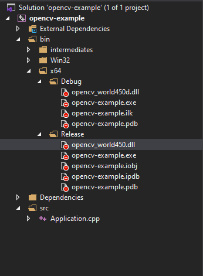

# opencv-vs2019
A Simple Guide to Install and Configure OpenCV with Visual Studio (19)

1. Download OpenCV
   Go to OpenCV website: [https://opencv.org/releases/](https://opencv.org/releases/) and dowload the latest version or other old version you need.

2. Extract OpenCV
    Run the exe file that you downloaded, run to decompressed, extra to somewhere on your disk
    
    

3. Create project and configuration  
   First, you need to create Empty Project (C++) in Visual Studio.
   

   Create two folder: Dependencies and src in your project
   
   
   Right click project -> Properties -> General.  
   For output directory: $(SolutionDir)bin\$(Platform)\$(Configuration)\  
   For intermediate output directory: $(SolutionDir)bin\intermediates\$(Platform)\$(Configuration)\ 
   For another option: C++ Langauge standard 14 or 17, etc

   

   C/C++ tag configuration:  
   General -> Additional Include Directories: $(SolutionDir)Dependencies\OpenCV\include  
   

   Linker tag configuration:  
   General -> Additional Libraries Directories: $(SolutionDir)Dependencies\OpenCV\x64\vc15\lib  
   

   Input -> Additional Dependencies: opencv_world450.lib;opencv_world450d.lib;%(AdditionalDependencies)  
    These lib file depen on what version of OpenCV you use for your project, just look up in vc15\lib 
    

    Finally, run test program, and copy .dll file to Debug or Release folder
    

4. Run test simple opencv project

5. Good luck! :D
